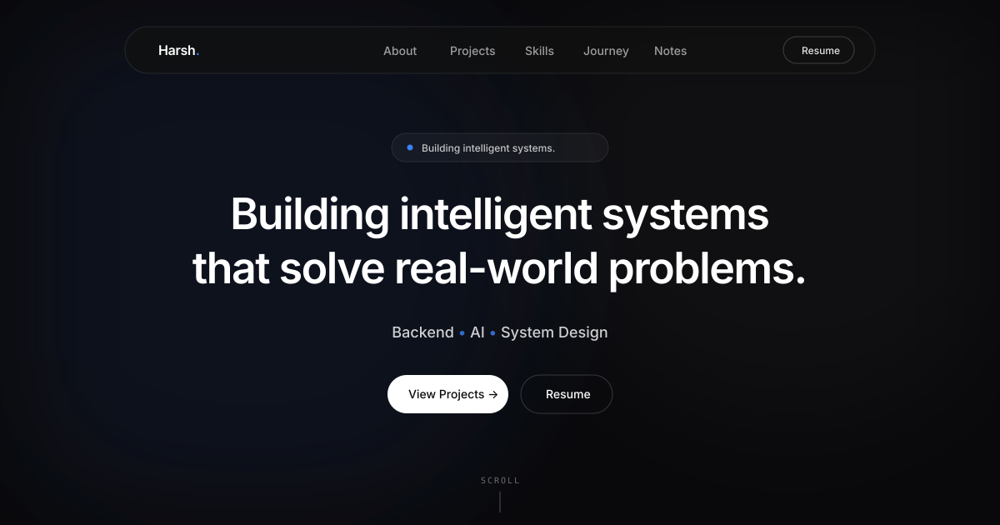
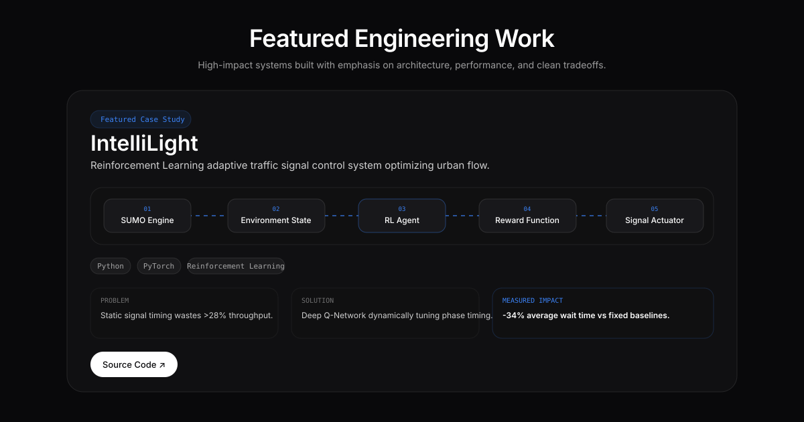

# 🌌 Harsh — Engineering Portfolio (Cinematic Minimalism)

> **"Building intelligent systems that solve real-world problems."**  
> A high-performance, dark-mode portfolio inspired by micro1 design philosophy, engineered with Next.js 16, GSAP ScrollTrigger, Lenis smooth scrolling, and Framer Motion.

---

## 📸 Previews

### 1. Hero Scene & Floating Glassmorphic Navbar


### 2. Featured Case Study & Animated SVG Architecture Diagram


---

## ⚡ Key Highlights & Architecture

- **Cinematic Scene Stacking (M4):** Full-screen Hero viewport with sticky desktop pinning (`scale: 1 → 0.94`, `brightness: 1 → 0.65`) as the About section stacks over it.
- **Line-Mask Text Reveals (M1):** Bespoke overflow-hidden heading reveals driven by GSAP `power4.out` easing.
- **Scroll-Scrubbed Statement Reveals (M2):** Word-by-word opacity illumination (`0.12 → 1.0`) linked to scroll velocity.
- **Cursor Spotlights & Magnetic CTAs (M6):** Dynamic radial spotlight tracking on cards and spring-based magnetic attraction on action buttons.
- **SVG Flow Diagrams:** Always-visible system architecture diagrams with flowing animated `stroke-dashoffset` connectors.
- **Data-Driven Architecture:** All copy, project metrics, philosophy notes, and links are completely isolated in `src/data/`.

---

## 🛠️ Tech Stack

| Layer | Technology |
|---|---|
| **Framework** | Next.js 16 (App Router, Turbopack) |
| **Language** | JavaScript (ESNext, React 19) |
| **Styling** | Tailwind CSS v4, Shadcn/UI Nova (Radix Primitives) |
| **Scroll Engine** | Lenis Smooth Scroll |
| **Scroll Motion** | GSAP ScrollTrigger (lagSmoothing: 0 bridge) |
| **Component Animation** | Framer Motion (AnimatePresence, Springs) |
| **Icons** | Lucide React + Custom Inline SVGs |

---

## 📂 Project Structure

```
src/
├── animations/
│   └── variants.js          # Shared motion variants & cinematic easing
├── app/
│   ├── globals.css          # Atmospheric gradients, grain filter, Lenis rules
│   ├── layout.js            # Geist font optimization & SEO metadata
│   └── page.js              # Recruiter flow page assembly
├── components/
│   ├── about/About.jsx      # Split-panel philosophy & interactive rail
│   ├── contact/Contact.jsx  # Minimalist CTA & magnetic pill links
│   ├── hero/Hero.jsx        # Full-screen hero, rotating decode eyebrow
│   ├── icons/               # Inline SVG brand icons
│   ├── motion/              # M1 line-mask, M2 scrubbed words, M6 micro-interactions
│   ├── navbar/Navbar.jsx    # Glassmorphism pill navbar with active tracking
│   ├── notes/Notes.jsx      # Typography masonry philosophy grid
│   ├── projects/            # Featured case studies & interactive SVG diagrams
│   ├── skills/Skills.jsx    # 4-column capability cards with detail reveal
│   └── timeline/Timeline.jsx# Scroll-linked journey with glowing milestone nodes
├── data/                    # Content layer (about, projects, skills, journey, notes, links)
├── hooks/                   # useLenis, useActiveSection, useReducedMotion
└── lib/                     # Design tokens & cn() utility
```

---

## 🚀 Getting Started

### Prerequisites
- Node.js `v20.x` or `v22.x`
- npm `v10.x` or higher

### Installation

```bash
# Clone the repository
git clone https://github.com/yourusername/portfolio.git

# Navigate into project directory
cd portfolio

# Install dependencies
npm install

# Start development server
npm run dev
```

Open [http://localhost:3000](http://localhost:3000) with your browser to explore the portfolio.

### Production Build

```bash
# Build optimized static bundle
npm run build

# Start production server
npm start
```

---

## ♿ Accessibility & Performance

- **Full `prefers-reduced-motion` Support:** Automatically bypasses all Lenis, GSAP, and parallax effects when enabled.
- **WCAG Compliant Contrast:** Body text never drops below 80% opacity (`#FFFFFF` on `#09090B`).
- **Semantic Structure:** Single `<h1>` tag with structured `<h2>`/`<h3>` hierarchy and full ARIA attributes.
- **Zero Asset Bloat:** 100% vector SVGs and pure CSS gradients (no heavy raster photos or WebGL memory leaks).

---

## 📄 License

MIT © [Harsh](https://github.com).
